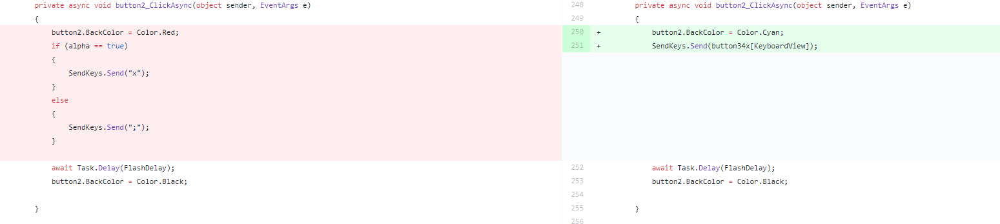
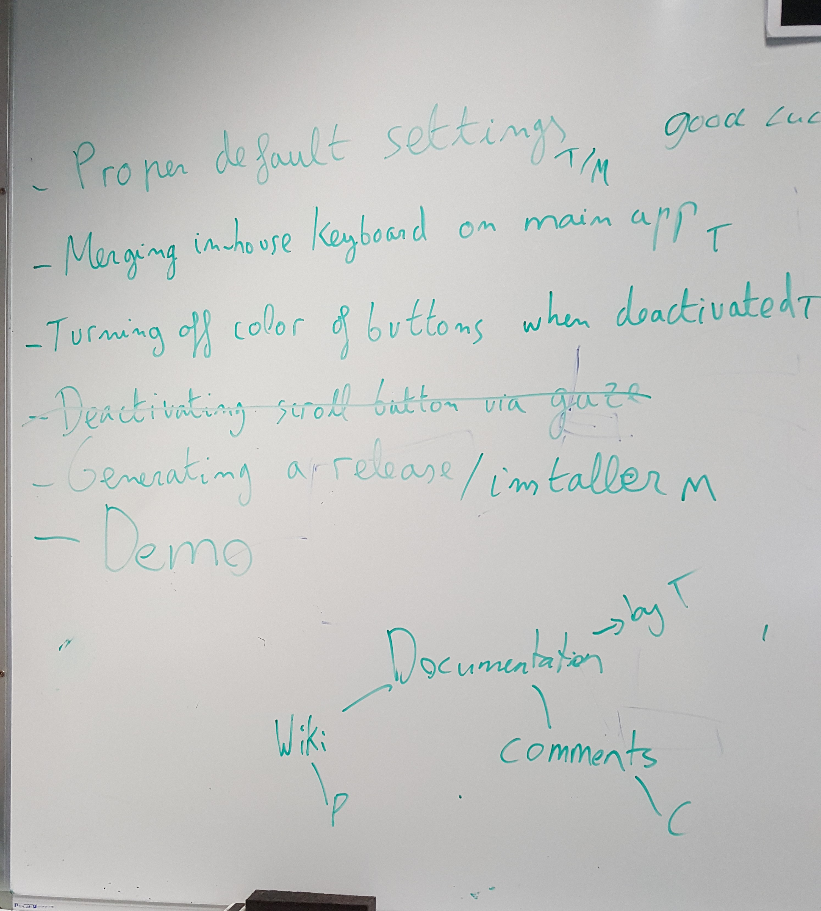

<<<<<<< HEAD
portfolio for project at Otago Polytechnic
=======
## Project One

### Week One
I familiarised myself with the wiki for the project and with the project code. Discussed with Phill what we were currently working on.

### Week Two
Assisted Phil in correcting the dynamic resizing of the keyboard. We peer coded together to work on correcting the code to resize the buttons and keyboard panel so they would resize in relation to the screen.
While assisting Phill, I found a more efficient way to code the keyboards that would allow for future expansion and make implementation of the shift key easier. We began implementing this and removed the hard coding from each button press and lessoned the amount of repetition. We also changed the code from having hard coded if statements in the shift and ‘abc’ button so now no code will need to be changed when a new set of keyboard screens are added. These changes were done through peer programming. We decided to do this because it was more effective than trying to both code in the same file at the same time from the different computers. It also allowed one person to research any issues we had while the other was coding.

### Week Three
As a group we met with Gray who went through the code with us. While doing this we made a list of tasks to do in the following weeks. We also discussed the current code and how it runs to better allow us to utilise the existing code in the future. We also recorded contact information so we could ask questions in the future. We managed to complete one of our tasks immediately as we were discussing deactivating the scroll button via gaze and looking at the code when I saw what we needed to do so we were able correct that issue then and there.

We also began using the whiteboard in front of our computers to write up our jobs. We have a list of the current tasks for the project and underneath we have a more detailed list of tasks that we are currently working on that specifies what each group member is doing. 

We completed rewriting the code on the keyboard to remove hard coded if statements and began working on implementing the shift key. 
I also spent one and a half hours doing volunteer work at Literacy Aotearoa. I assisted in setting up a computer for them and other software such as their email client and office 360.

### Week Four
Implemented the shift key to switch between the capitals and lowercase. I also added another keyboard screen with function keys.
Completed the function keyboard. While adding the new keys to the keyboard I also set up a method designed to strip off the curly brackets from the button lists. The send.Keys function requires them for certain characters but we didn’t want them displayed as part of the keyboard. Previously we had been removing the brackets from individual keys that we knew required this but after some thought I decided to apply the stripping to all keys. This was to pre-emptively account for more keys being added in the future that would require stripping of curly brackets. I also commented the code to improve documentation for any future students working on the project.

### Week Five
#### Monday
Created an installer to be used for the release. re-organised the whiteboard after consulting with Phill to now show a more current list of tasks that we need to do.

#### Thursday
Consulted with Phill over the demo we are going to create. We collaborated over a design for the demo and proposed a design that will be finalised at a later date. We went over the issues given to us with the installer we made on monday.

#### Friday
Completed Volunteer work at age concern. From 1-3 I helped the elderly with their computer issues.

### Week Six
#### Monday
Consulted with David over the remaining issues with the release. Helped Phill fix a few bugs and then we created a new installer to be tested.
Showed David the finalised design for the demo and began to plan out our strategy for creating the demo.

#### Thursday
We created the homepage for the demo. The behaviour map is now reacting to gaze. Buttons react when they get gaze but currently do not lead anywhere.

### Week Seven
#### Monday
Showed the homepage to David. Began working on the second screen for the demo. Second screen currently has buttons in place and is dynamically sizing to the screen. I also added dynamic resizing to the homepage to account for different screens.

#### Tuesday
Professional Development. Attended CodeCraft. They discussed the need and changing landscape in security with regards to technology. The discussion was also about how web all need to think more about security when we develop applications and our responsibility.

#### Thursday
Continued work on the dynamic resizing of the information page. Phill and I discussed the dynamic zooming and agreed to leave it for now and prioritize the demonstration software.

#### Friday
11-12.30 I attended volunteer work at the South Dunedin Pop-up library where I assisted the elderly with their computing issues.

### Week Eight
#### Monday
We had a look at the work required for the demo to be finished by week nine of the semester. Because Phill is no longer going to be working on the dynamic zooming problems we redistributed the work between the two of us. I have left my work on the Information pages to Phill as he was more interested in getting the sizing done correctly, and he has more experience with it from his work on the keyboard while I work on the eye tracking side of the demo.
>>>>>>> b1456f9bf71dc4a1b9e8c68b012e7a5f7fecc3a6
