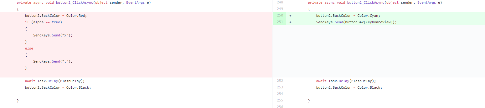

## Project One

### Week One
I familiarised myself with the wiki for the project and with the project code. Discussed with Phill what we were currently working on.

### Week Two
Assisted Phil in correcting the dynamic resizing of the keyboard. We peer coded together to work on correcting the code to resize the buttons and keyboard panel so they would resize in relation to the screen.
While assisting Phill, I found a more efficient way to code the keyboards that would allow for future expansion and make implementation of the shift key easier. We began implementing this and removed the hard coding from each button press and lessoned the amount of repetition. We also changed the code from having hard coded if statements in the shift and ‘abc’ button so now no code will need to be changed when a new set of keyboard screens are added. These changes were done through peer programming. We decided to do this because it was more effective than trying to both code in the same file at the same time from the different computers. It also allowed one person to research any issues we had while the other was coding.

### Week Three
As a group we met with Gray who went through the code with us. While doing this we made a list of tasks to do in the following weeks. We also discussed the current code and how it runs to better allow us to utilise the existing code in the future. We also recorded contact information so we could ask questions in the future. We managed to complete one of our tasks immediately as we were discussing deactivating the scroll button via gaze and looking at the code when I saw what we needed to do so we were able correct that issue then and there.

We also began using the whiteboard in front of our computers to write up our jobs. We have a list of the current tasks for the project and underneath we have a more detailed list of tasks that we are currently working on that specifies what each group member is doing. 

We completed rewriting the code on the keyboard to remove hard coded if statements and began working on implementing the shift key. 
I also spent one and a half hours doing volunteer work at Literacy Aotearoa. I assisted in setting up a computer for them and other software such as their email client and office 360.

### Week Four
Implemented the shift key to switch between the capitals and lowercase. I also added another keyboard screen with function keys.
Completed the function keyboard. While adding the new keys to the keyboard I also set up a method designed to strip off the curly brackets from the button lists. The send.Keys function requires them for certain characters but we didn’t want them displayed as part of the keyboard. Previously we had been removing the brackets from individual keys that we knew required this but after some thought I decided to apply the stripping to all keys. This was to pre-emptively account for more keys being added in the future that would require stripping of curly brackets. I also commented the code to improve documentation for any future students working on the project.

### Week Five
#### Monday
Created an installer to be used for the release. re-organised the whiteboard after consulting with Phill to now show a more current list of tasks that we need to do.

#### Thursday
Consulted with Phill over the demo we are going to create. We collaborated over a design for the demo and proposed a design that will be finalised at a later date. We went over the issues given to us with the installer we made on monday.

#### Friday
Completed Volunteer work at age concern. From 1-3 I helped the elderly with their computer issues.

### Week Six
#### Monday
Consulted with David over the remaining issues with the release. Helped Phill fix a few bugs and then we created a new installer to be tested.
Showed David the finalised design for the demo and began to plan out our strategy for creating the demo.

#### Thursday
We created the homepage for the demo. The behaviour map is now reacting to gaze. Buttons react when they get gaze but currently do not lead anywhere.

### Week Seven
#### Monday
Showed the homepage to David. Began working on the second screen for the demo. Second screen currently has buttons in place and is dynamically sizing to the screen. I also added dynamic resizing to the homepage to account for different screens.

#### Tuesday
Professional Development. Attended CodeCraft. They discussed the need and changing landscape in security with regards to technology. The discussion was also about how web all need to think more about security when we develop applications and our responsibility.

#### Thursday
Continued work on the dynamic resizing of the information page. Phill and I discussed the dynamic zooming and agreed to leave it for now and prioritize the demonstration software.

#### Friday
11-12.30 I attended volunteer work at the South Dunedin Pop-up library where I assisted the elderly with their computing issues.

### Week Eight
#### Monday
We had a look at the work required for the demo to be finished by week nine of the semester. Because Phill is no longer going to be working on the dynamic zooming problems we redistributed the work between the two of us. I have left my work on the Information pages to Phill as he was more interested in getting the sizing done correctly, and he has more experience with it from his work on the keyboard while I work on the eye tracking side of the demo.

#### Thursday
Began working on the paint program. Created the layout of the pages and the panels. Began the process of making the panels dynamically resize and appear on screen when needed.
Work on the actual paint program began. Currently it will read in eye fixations but there is a problem where it will only read a few eye locations before stopping. The canvas is being drawn onto a panel which meant we have to use the paint method instead of drawing using graphics like we normally would. The lines are being drawn on the screen to the locations being looked at from a list of points.

### Holidays
Tried to implement double buffering using the overwritten paint method but in the end this was proving to be too clunky and was over complicating the code. Instead I am drawing the canvas straight onto the form instead of a panel. Originally we had planned on lighting up the panel behind the canvas to show the user when they were drawing but with this new plan that functionality has been given up.
The paint program is now drawing circles from the list instead of lines. This means that we can change the shape being drawn. I have also created a paintline class. This means the user can create different lines with different colours and thickness. 
Added a behaviourmap so buttons are now gaze reactive. I also created panels behind buttons so they will light up when fixation begins.
Created an Undo button that removes the last line drawn to screen.
Implemented functionality to change the background colour of the canvas.
After searching through the project I have changed the eye tracking for painting. Before we were using the fixationDetection class. This was causing problems because it would only read in a few amounts of points and would not provide a steady stream of points. After investigation of classes available in the project, the source has been changed to a customDataStream. This gives the paint program a steady stream of data which means we can now draw lines of circles. The lines being drawn are now more consistant and reliable.
I have also added a second timer to the form. This way there is one set at a 100ms interval that controls the drawing of the canvas and another timer set at 1ms to capture all the eye data. This was important to set up because if we were drawing every 1ms, the canvas would be constantly flashing and would not buffer correctly and would be unusable. We needed the second timer at a smaller interval to get a more steady stream of eye tracking data that would draw a more steady line of circles instead od sparadoc circles.
Currently the mouse still needs to be used when painting because the behaviour map is not interacting with the button correctly.

### Week Nine
#### Monday
I have added in the funtionality into the paint program to now change the shape of the brush. Users now have the option to draw lines of circles or squares. Originally we had planned on having a thrid "fun" option but after some discussion with Phill, I have decided not to implement this because a lot of the other options involved getting more points or more maths to draw and we thought it there were better things to focus on.
I have also created a clear button that will wipe all previously drawn lines from the list to create an empty canvas instead of just an undo button.
I have also added some information into the repository for Phill to use in the information pages. I have also taken photos of different projects to be used in the demo as we couldn't find appropriate photos on the internet.
#### Thursday
Added a few more pictures for the demo pages after talking to a few more projects.
We have given up on the starting painting and ending paintlines on the one button. Phill and I spent the afternoon investigating why it seemed to not work on the one button and have found the problem. After multiple trials and testing different implementations we discouvered that for some reason the fixation will click on the button twice in quick succession. We attempted to stop this by adding a timer or delay before letting the button activate again but it didn't work correctly and the paint button would just turn off almost immediately afterwards. 
Eventually we gave up and mutually decided to change the program to work off two buttons. A paint button and a stop button. These buttons are both working using gaze tracking. Next week we are going to investigate the possibilty of recombining them into one. As of now the whole software demo is 100% gaze interactive.

### Week Ten
#### Monday
Added contraints to the canvas so the lines are only drawing within the canvas instead of over the whole page. Lines now end when any button is pushed whereas before there was a tendency to delete the currently drawing line when you pushed the background or brush setting buttons.
I have also changed the paint buttons. While they are still seperate buttons, the paint and stop buttons are only shown one at a time and in the same location. We encountered the same problem with the behaviour map where buttons were interacting incorrectly and code was not working. In this case I was dynamically reading the locations of buttons and swapping their locations. The problem occured during this where the program and behaviour map was running the code too quickly or at the same time and as a result after clicking the button twice, both would end up off screen. I fixed this by having a variable hold the locations of the buttons on and off screen. This was quite enlightening for us because it gave us further understanding of what was going wrong with running paint off a single button and further gave evidence that we had made the right choice in changing to work off two buttons.
#### Thursday
I added more pictures to the demo that were sent to me from other projects. I have also commented the demo project and paint. I have also refactered some of the code to use variables instead of having numbers in the actual code. While doind this I also corrected some of the colors to be consistant through the whole project instead of the temporary ones we had been using.

### Week Eleven
#### Monday
I have added and written more information to be used in the demo. I also asked the project groups in the area about their projects to more accurately depict them in the project.
I have also started refactoring code more and cleaning it up. I found a simpler way to code the keyboard up for the Gaze toolbar so I wrote the code out into a word document and sent it to Phill to implement. I sent it to him to implement instead of doing it myself because he was working on the project at the time while I was working on the demo software. So instead of risking a merge conflict or other issue arising if we were trying to work on the same branch and file at the same time I let him do it.
#### Thursday
Once again I worked on refactoring code. We were doing a lot of dynamic resizing of the information Pages in the Software demo. Phill had written it with a lot of repeated code so I worked to consolidate the resizing and display changes into more ambiguous methods that meant it was more streamlined and cut down on the code. It also made it easier to read. I also worked on the wiki. I created new images for the Gaze Toolbar wiki and edited the documentation for the software demonstration. 

### Week Twelve
#### Monday
David had identified a bug with the toolbar stopping working when the keyboard was open. Together, Phill and I worked on attempting to find this bug and working out where it was coming from. We repeatedly attempted to replicate the bug by stress testing the gaze toolbar. We also began working on smaller bugs that had been identified by David to be fixed before the next release.
#### Thursday
We continued bug fixing and attempting to replicate the bug with the keyboard. We also went through checking that various features were still working such as the auto-start button. We also began removing features from the settings page. This was particularly frustrating because we couldn't find the right panels easily because of how the settings page was created. Instead I had to open the solution on my computer and search for the panels to find the correct one then we would change it on Phill's version. This was because we literarly cannot move anything on the settings page and have to do it all programatically.
We also had Adon test the demonstration software so we could get feedback.

### Week Thirteen
At the request of Adon, I created a simplified version of paint that has less features on it and draws continuously. I also fixed a centering issues on bother versions of paint. I also went through the previous code to find how scrolling was implemented and began implementing the code in the demonstration so we could change from buttons to scrolling. I also created a troubleshooting section on the wiki so users can find solutions to problems they may have encountered. I also installed the software on various computers to test that it would install correctly and to get screen shots of the warnings that may come up. I have added pictures of warnings to the wiki along with explanations of why they are there for users.

### Week Fourteen
#### Monday
After talking to David and Phill the decision was made that instead of linking the the gaze toolbar wiki that the class information should be directly stored on the DemoSoftware. This was decided because in the future the classes for the gaze toolbar may be removed or changed drastically from the demonstration and it would be no longer be relevant to the demo. I copied over the text to the new wiki and edited the entries. I also worked on the user guide for the gaze toolbar. I removed references to funtions and features that were no longer relevant and updated images. I also researched the best method to store the information for the software demonstration. Initially, Phill and I had considered saving a PDF with the information and loading it into the program but after research we found that would require downloading extentions and adding unnessesary work. Instead we decided on creating images to store the information.
#### Thursday
I assisted Phill with locating and editing panels on the settings page and removing them. I also continued trying to recreate the freezing bug that we have been encountering. After Phill had added the scrolling, so I assisted him in converting the word documents into images to store in the program. We encountered an issue with this as the git repository became too big and would not allow us to commit anything. As a result we had to reclone and commit all the changes Phill had implemented. I also went through all the old code and removed the resizing and positioning of buttons that had been commented out.

### Week Fifteen
#### Monday
We had approval to begin our release but we had to wait because Phill had found a solution to the keyboard issue and we needed to wait for David to check it would work on his computer. While we were waiting we began finalizing the last few profiles on the software demonstration. We also investigated changing the default branch on the gazetoolbar repository but we did not have the correct permissions at the time so we had to wait.
#### Thursday
By Thursday we had recieved approval to create the new release, 'Gaze Toolbar 2.0'. We created the release on the git repository. Before doing this we used our newly given permissions to rename the master branch and Phill's keyboard branch and change the default repository to the new master. This was because we were having problems with merging our work into the master. Our version was the most up to date and so we decided it would be better as the default. Since we had changed the default branch we could now move the wiki images that had previously been stored on the software demo over to the gaze toolbar repository. We also updated the Assessibility hub website to now include, Phill, Gray and I along with short profiles we wrote. We deleted a few more unnessesary comments from the code and did a general cleanup of code. We also created the final version of the demonstration software. Despite promising to send us a profile, we had still not recieved one from Adon so as a result we wrote our own one for him.

### Week Sixteen
#### Monday
#### Thursday
